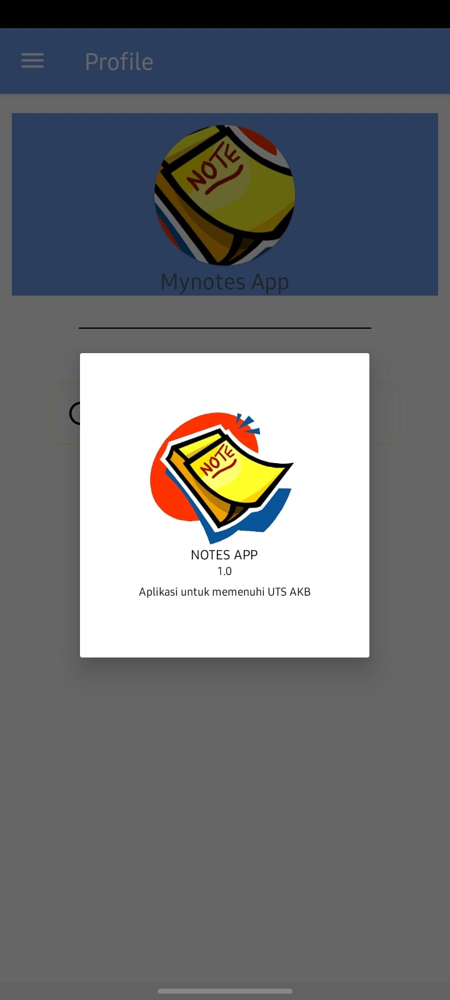
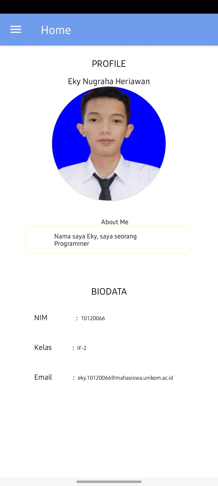
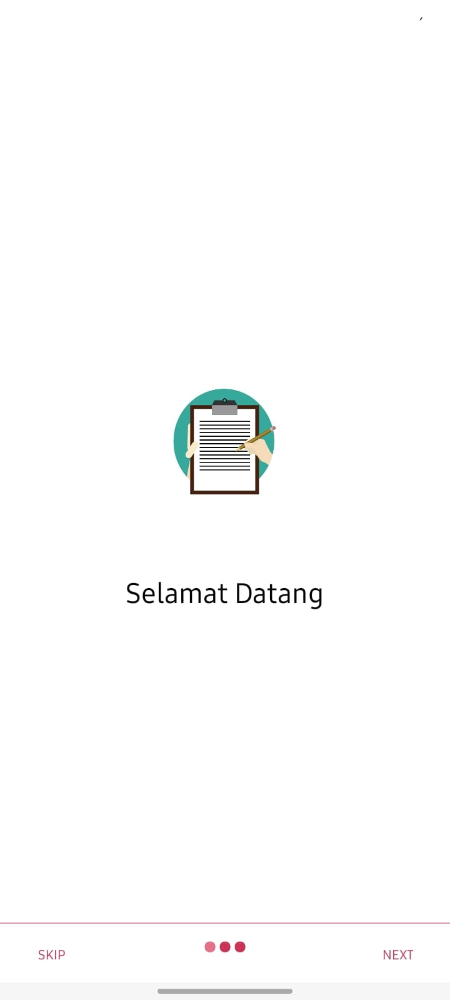
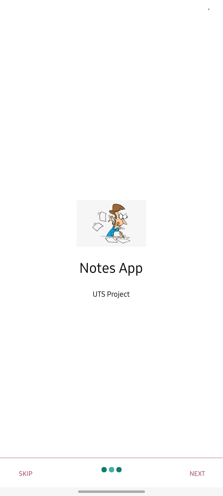

# project-notes-apk

NIM   : 10120066
Nama  : Eky Nugraha Heriawan
Kelas : IF-2

Project Notes Application ini dibuat untuk memenuhi salah satu tugas mata kuliah
"Aplikasi Komputasi Bergerak" yaitu dengan membuat Notes Application  sederhana
dengan menggunakan Android Studio

#Preview

    

    

    

    

    

    

    

    

